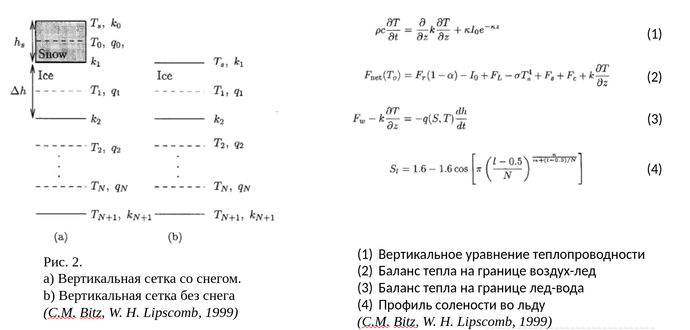

# Задача машинного обучения: Прогнозирование толщины льда

## 1. Класс задачи МО
С учителем

## 2. Вид задачи МО
Регрессия

## 3. Целевая переменная
Толщина льда (в метрах) в определенной точке океана в заданный момент времени.  
**Тип**: действительная  
**Размерность**: 1 (одно значение на объект/событие)

## 4. Функция потерь
Среднеквадратичная ошибка (MSE):

$$L = (1/n) \cdot \sum(y_i - \hat{y_i})^2$$

где:
- $n$ - количество объектов в выборке
- $y_i$ - истинное значение толщины льда для i-го объекта
- $\hat{y_i}$ - предсказанное значение толщины льда для i-го объекта

## 5. Объекты (события)
### 5.1 Объекты
Объектом в данной задаче является состояние определенной точки поверхности льда в конкретный момент времени.
### 5.2 События
Возможно учитываемые события:
 - Таяние льда на граница атмосфера-лед за счет солнечной радиации (длинные короткие волны)
 - Таяние льда на границе лед-океан за счет нагревания нижней границы льда водой океана
 - Столкновение льдин и их разрушение
 - Изменение альбедо льда из-за внешних факторов атмосферы  
 - В какой-то степени учесть физику теплопереноса во льду:
 
## 6. Признаковое описание объектов/событий
Признаковое описание объекта включает:

1. Координаты точки (широта, долгота): действительные, 2 признака
2. Время (Unix timestamp): действительный, 1 признак
3. Параметры атмосферы:
   - Температура воздуха (°C): действительный, 1 признак
   - Скорость ветра (м/с): действительный, 1 признак
   - Влажность (%): действительный, 1 признак
   - Атмосферное давление (гПа): действительный, 1 признак
4. Параметры океана:
   - Температура воды (°C): действительный, 1 признак
   - Соленость воды (‰): действительный, 1 признак
   - Скорость течения (м/с): действительный, 1 признак
5. Начальные условия льда:
   - Начальная толщина льда (м): действительный, 1 признак
   - Возраст льда (дни): целочисленный, 1 признак

Общая размерность признакового пространства: 12 признаков

## 7. Возможные варианты дополнения или понижения размерности признакового описания
1. Дополнение:
   - Добавление признака "сезон" (категориальный, 4 значения)
   - Включение данных о солнечной радиации (действительный)
   - Учет близости к берегу (действительный)

2. Понижение размерности:
   - Применение метода главных компонент (PCA) к атмосферным и океаническим параметрам
   - Создание интегрального показателя "суровость погодных условий"

## 8. Меры для оценки качества модели
1. Коэффициент детерминации ($R^2$):

$$R^2 = 1 - \frac{\sum(y_i - \hat{y_i})^2}{\sum(y_i - \bar{y_i})^2}$$

- где $\bar{y_i}$ - среднее значение толщины льда в выборке

2. Средняя абсолютная ошибка (MAE):

$$MAE = (1/n) \cdot \sum|y_i - \hat{y_i}|$$

3. Корень из среднеквадратичной ошибки (RMSE):

$$RMSE = \sqrt{(1/n) \cdot \sum(y_i - \hat{y_i})^2}$$

- $R^2$ дает представление о доле объясненной дисперсии.

- $MAE$ и $RMSE$ это функции потерь, однако их можно использовать как меры качества 